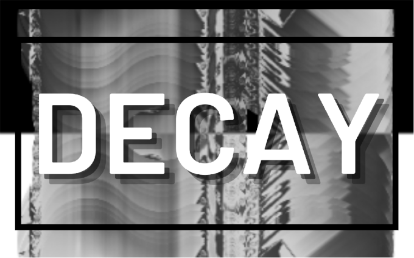

# DECAY: Diverse Events & Creative Arts Yard
## Open Source Workshops

This collection of course materials is for facilitating workshops at DECAY.

If you have expertise in a given area, you should be able to use these materials to put together a workshop.

## Workshops

* [Intro to Microcontrollers](intro.to.microcontrollers/README.md)
* [Intro to Digital Logic](intro.to.digital.logic/README.MD)
* 

Happy Hacking!  
  
These course materials are [licensed](LICENSE.MD) w/ [GPL 3.0](https://www.gnu.org/licenses/gpl-3.0.en.html)  
(C) Alex R. Delp 2024